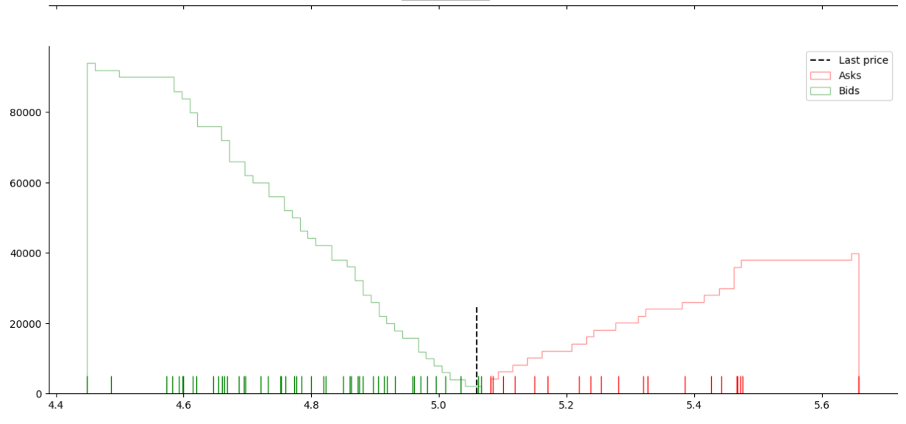

# EcoSys

> Market simulator for stock mechanics

> Simulator, Virtual investing, Educational

---
'
## Installation

- Clone or download the source code this repo to your local machine using `https://github.com/Miksus/ecosys.git`

---

## Features
- Market Matcher that support multiple order types

### Upcoming Features
- Simulated traders for inspecting behavioral aspects of trading and the mechanics of trading decision making
- Compete with the traders
- IPO system

## Usage
> Please see [Market Matching Demo](docs/maket_demo.ipynb)

## Test
Pytest was chosen as testing suites. Tests are found in test directory. 

---

## Author

* **Mikael Koli** - [Miksus](https://github.com/Miksus) - koli.mikael@gmail.com

---
## License

- **[MIT license](http://opensource.org/licenses/mit-license.php)**
- Copyright 2019 © Mikael Koli.